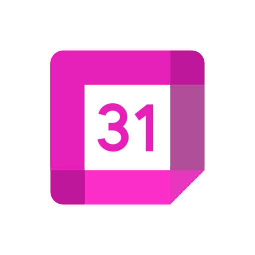

  

# EDorganisr

**Français** | [English](#english)

---

## Français

EDorganisr est une application d'organisation personnelle et collaborative disponible sur Windows, Linux, macOS et Android.

### Fonctionnalités

- Gestion des tâches, groupes et tableaux de bord
- Agenda et suivi des événements
- Bloc-notes intégré
- Gestion d'entreprises, membres et invitations
- Badges QR et pointage pour les équipes
- Interface réactive adaptée bureau et mobile

### Plateformes

| Plateforme | Format |
|------------|--------|
| Windows | `.exe` (installeur NSIS) |
| Linux | `.tar.gz` |
| macOS | `.dmg` |
| Android | `.apk` |

### Installation

Télécharge la dernière version depuis les [releases GitHub](https://github.com/3yezz/Organisr/releases).

### Stack technique

- **Interface** : React 18
- **Temps réel** : Socket.io
- **QR Code** : qrcode-generator, ZXing
- **Documents** : jsPDF
- **Bureau** : Electron
- **Mobile** : Android natif (WebView)
- **Build** : electron-builder, Gradle

---

## English

EDorganisr is a personal and collaborative organization app available on Windows, Linux, macOS and Android.

### Features

- Task, group and dashboard management
- Calendar and event tracking
- Shared shopping lists
- Built-in notes
- Company, member and invitation management
- QR badges and team time tracking
- Responsive interface for desktop and mobile

### Platforms

| Platform | Format |
|----------|--------|
| Windows | `.exe` (NSIS installer) |
| Linux | `.tar.gz` |
| macOS | `.dmg` |
| Android | `.apk` |

### Installation

Download the latest version from the [GitHub releases](https://github.com/3yezz/Organisr/releases).

### Tech stack

- **UI** : React 18
- **Real-time** : Socket.io
- **QR Code** : qrcode-generator, ZXing
- **Documents** : jsPDF
- **Desktop** : Electron
- **Mobile** : Android native (WebView)
- **Build** : electron-builder, Gradle
